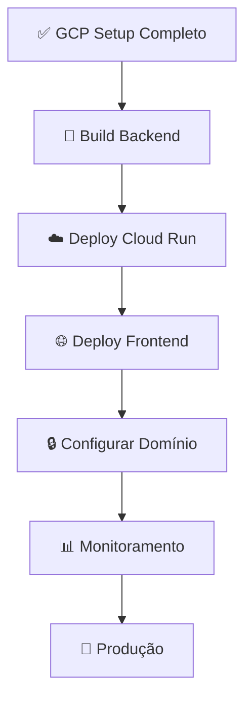

# ⚡ Início Rápido - Google Cloud Setup

**Tempo:** 5 minutos para começar | 1 hora para configuração completa

---

## 🚀 Início Rápido (5 minutos)

### 1️⃣ Execute o Script Automático

```bash
cd Integracao-zeroclaw-agro-link/DEPLOY
chmod +x gcp-setup.sh
./gcp-setup.sh
```

O script vai:
- ✅ Verificar dependências (gcloud, Docker, git)
- ✅ Autenticar sua conta Google
- ✅ Criar projeto no GCP
- ✅ Ativar API necessárias
- ✅ Criar Cloud SQL (PostgreSQL)
- ✅ Criar Redis
- ✅ Criar Cloud Storage Buckets
- ✅ Gerar arquivo `.env.gcp`

### 2️⃣ Configure o Banco de Dados

Após o script terminar:

```bash
# Conectar ao Cloud SQL
gcloud sql connect agro-postgres-prod --user=root

# No prompt PostgreSQL, execute:
CREATE USER agro_app WITH PASSWORD 'sua_senha_segura_aqui';
GRANT ALL PRIVILEGES ON DATABASE agro_prod TO agro_app;
ALTER DEFAULT PRIVILEGES IN SCHEMA public GRANT ALL ON TABLES TO agro_app;
\q
```

### 3️⃣ Edite o Arquivo `.env.gcp`

```bash
nano .env.gcp
```

Configure:
- `PASSWORD_AQUI` → senha que você setou acima
- `GERAR_CHAVE_SEGURA_AQUI` → gere com: `python -c "import secrets; print(secrets.token_urlsafe(50))"`
- `seu-dominio.com` → seu domínio customizado (ou deixe vazio por enquanto)

---

## 📖 Documentação Completa

Leia a documentação completa em `Integracao-zeroclaw-agro-link/DEPLOY/`:
- [GOOGLE_CLOUD_SETUP.md](GOOGLE_CLOUD_SETUP.md) → Configuração manual passo-a-passo
- [ARQUITETURA_WHATSAPP_2DOMINIOS.md](ARQUITETURA_WHATSAPP_2DOMINIOS.md) → Fluxos técnicos
- [SIMULACAO_CUSTOS_GCP.md](SIMULACAO_CUSTOS_GCP.md) → Análise de custos
- [INDICE_DOCUMENTACAO.md](INDICE_DOCUMENTACAO.md) → Índice completo

---

## 🎯 Próximos Passos

### Depois de Completar Setup:



**Sequência recomendada:**

1. **Backend (30 min)**
   ```bash
   cd project-agro.bak-20260312043346/sistema-agropecuario
   gcloud builds submit --tag=gcr.io/PROJECT_ID/agro-backend:latest
   gcloud run deploy agro-backend \
     --image=gcr.io/PROJECT_ID/agro-backend:latest \
     --region=us-central1 \
     --add-cloudsql-instances=PROJECT_ID:us-central1:agro-postgres-prod
   ```

2. **Frontend (15 min)**
   ```bash
   cd Integracao-zeroclaw-agro-link
   npm run build
   gsutil -m cp -r build/* gs://agro-system-prod-frontend/
   ```

3. **Configurar Domínio (10 min)**
   - Apontar DNS para Cloud Run
   - Configurar SSL automático

4. **Monitoramento (5 min)**
   - Ver logs: `gcloud logging read`
   - Criar alertas no Console

---

## ❓ Dúvidas Comuns

### D: Qual projeto atual está na GCP?
**R:** Se é a primeira vez, você ainda não tem nenhum. O script cria tudo do zero.

### D: Posso usar banco de dados local?
**R:** Sim, para desenvolvimento local. Mas produção deve ser na Cloud SQL.

### D: Quanto vai custar?
**R:** ~$50-100/mês para desenvolvimento. Ajuste recursos conforme uso.

### D: Como faço rollback?
**R:** Cada versão de build fica salva. Faça redeploy de versão anterior.

### D: Preciso de domínio customizado?
**R:** Não é obrigatório agora. Cloud Run oferece URL padrão (*.cloudrun.app).

---

## 📋 Checklist de Configuração

Depois do setup, verifique:

```bash
# 1. Autenticação
gcloud auth list
# Esperado: conta ativa

# 2. Projeto
gcloud config get-value project
# Esperado: PROJECT_ID configurado

# 3. APIs ativas
gcloud services list --enabled | grep -E "sql|redis|run|storage"
# Esperado: todos os serviços

# 4. Cloud SQL
gcloud sql instances list
# Esperado: agro-postgres-prod

# 5. Redis
gcloud redis instances list --region=REGION
# Esperado: agro-redis-prod

# 6. Storage
gsutil ls -b
# Esperado: 3 buckets

# 7. Arquivo de config
cat .env.gcp
# Esperado: todas variáveis preenchidas
```

---

## 🆘 Troubleshooting Rápido

### Erro: "Projeto não encontrado"
```bash
# Verificar projetos disponíveis
gcloud projects list

# Criar novo projeto
gcloud projects create meu-projeto
```

### Erro: "Permissão negada"
```bash
# Verificar permissões
gcloud projects get-iam-policy PROJECT_ID

# Adicionar permissão manualmente
gcloud projects add-iam-policy-binding PROJECT_ID \
  --member=user:seu-email@gmail.com \
  --role=roles/editor
```

### Erro: "Cloud SQL timeout"
```bash
# Pode estar criando ainda, aguarde 5-10 min
gcloud sql instances describe agro-postgres-prod
# Verifique "state": "RUNNABLE"
```

### Erro: "Redis não conecta"
```bash
# Verificar IP
gcloud redis instances describe agro-redis-prod

# Testar conectividade (do Cloud Run)
redis-cli -h IP_DO_REDIS -p 6379 ping
```

---

## 🔐 Segurança - Não Esqueça!

- [ ] Adicionar `.env.gcp` no `.gitignore`
- [ ] Adicionar `agro-backend-key.json` no `.gitignore`
- [ ] **Nunca fazer commit** de chaves de API
- [ ] Usar VPC para isolar recursos
- [ ] Configurar firewall do Cloud SQL
- [ ] Habilitar Cloud Logging para auditoria
- [ ] Fazer backups automáticos
- [ ] Rotación regular de chaves

---

## 📚 Referências Rápidas

| Comando | O quê faz |
|---------|-----------|
| `gcloud auth login` | Autenticar na Google |
| `gcloud config set project ID` | Selecionar projeto |
| `gcloud services list --enabled` | Ver APIs ativas |
| `gcloud sql instances list` | Ver Cloud SQL |
| `gcloud redis instances list --region=REGION` | Ver Redis |
| `gsutil ls` | Listar buckets |
| `gcloud logging read` | Ver logs |
| `gcloud run services list` | Ver Cloud Run deployments |

---

## ✅ Status

- **Guia criado:** ✅
- **Script de automação:** ✅
- **Documentação completa:** ✅
- **Pronto para usar:** ✅

**Próximo passo:** Navegue até a pasta e execute o script!

```bash
cd Integracao-zeroclaw-agro-link/DEPLOY
./gcp-setup.sh
```

---

*Dúvidas? Veja [GOOGLE_CLOUD_SETUP.md](GOOGLE_CLOUD_SETUP.md) para documentação detalhada.*
