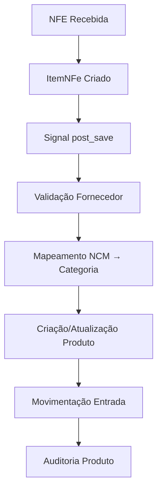
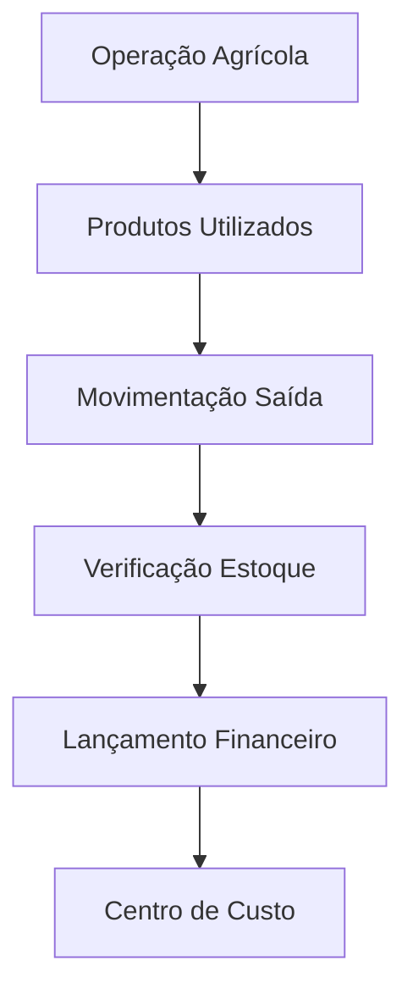
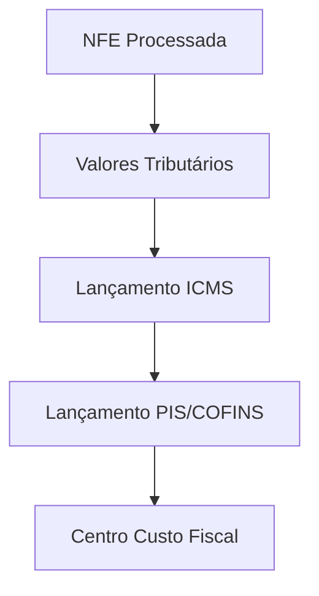
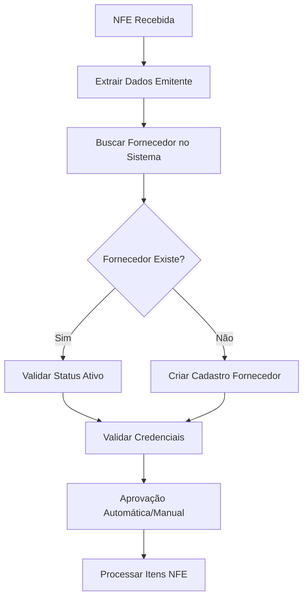
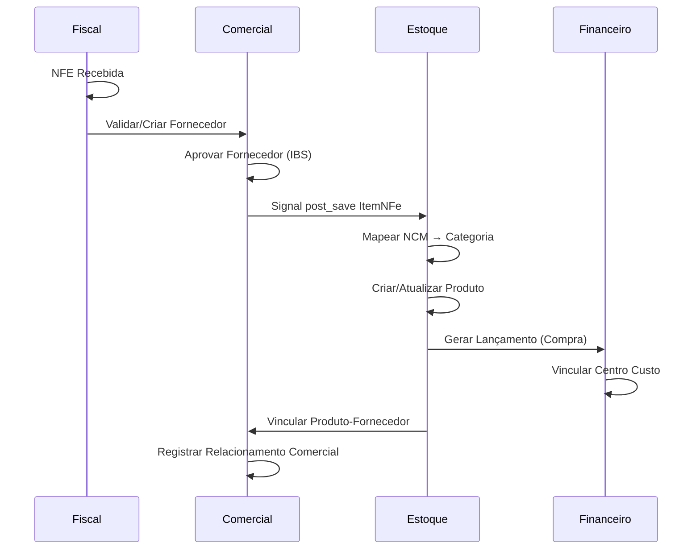
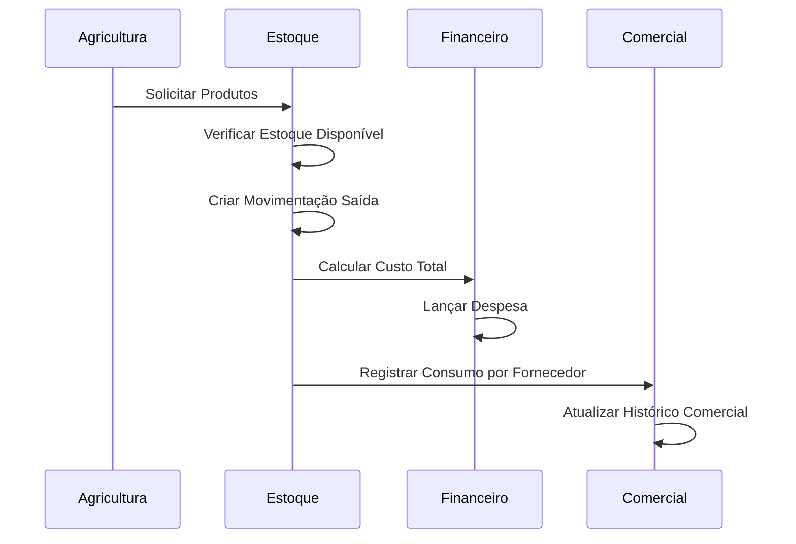
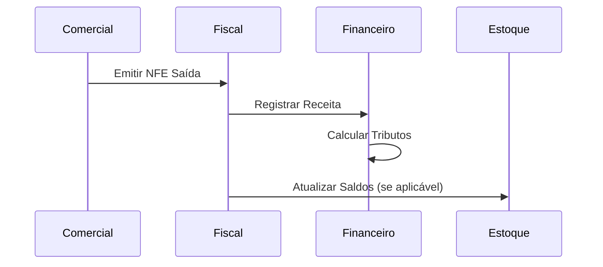

# 📋 Especificações Técnicas: Integração Estoque ↔ Comercial ↔ Financeiro ↔ Fiscal

**Data:** 25/12/2025  
**Última Revisão:** 03/03/2026  
**Versão:** 1.2  
**Status:** ✅ Implementado

**Nota (03-Mar-2026):** A integração entre Estoque, Comercial, Financeiro e Fiscal é funcional e tenant-aware. Para detalhes operacionais e runbooks mais longos, ver `docs/archived/` (ex.: `RUNBOOK_CERTIFICADOS_A3.md`).

---

## 🎯 Visão Geral

Este documento especifica a **integração completa** entre os módulos **Estoque**, **Comercial**, **Financeiro** e **Fiscal** do Agrolink. A integração garante consistência de dados, automação de processos e conformidade fiscal em todas as operações.

---

## � Diagrama Geral de Integrações

```mermaid
graph TD
    %% Back-end Modules (Django Apps)
    subgraph "Back-end (Django)"
        core[Core<br/>Users, Auth]
        administrativo[Administrativo<br/>Funcionários, Centros de Custo, Folha]
        financeiro[Financeiro<br/>Rateios, Vencimentos, Financiamentos]
        comercial[Comercial<br/>Empresas, Contratos, Compras/Vendas]
        agricultura[Agricultura<br/>Culturas, Safras, Operações]
        estoque[Estoque<br/>Produtos, Movimentações]
        fazendas[Fazendas<br/>Proprietários, Áreas, Talhões]
        maquinas[Máquinas<br/>Equipamentos, Abastecimentos]
        fiscal[Fiscal<br/>Certificados, NFEs]
        i18n[I18n<br/>Languages]
    end

    %% Front-end Pages/Components
    subgraph "Front-end (React/Vite)"
        Dashboard[Dashboard<br/>Overview]
        AdminPage[Administrativo<br/>Funcionários, Centros, Folha]
        FinancePage[Financeiro<br/>Rateios, Vencimentos, Dashboard]
        CommercialPage[Comercial<br/>Empresas, Fornecedores, Contratos]
        AgPage[Agricultura<br/>Culturas, Operações, Colheitas]
        StockPage[Estoque<br/>Produtos, Movimentações]
        FarmPage[Fazendas<br/>Proprietários, Áreas, Talhões]
        MachinePage[Máquinas<br/>Equipamentos, Manutenção]
        FiscalPage[Fiscal<br/>Certificados, NFEs]
        Auth[Auth<br/>Login/Register]
    end

    %% API Connections (via Axios/React Query)
    Auth -->|"JWT Auth"| core
    Dashboard -->|"Health, Resumos"| core
    AdminPage -->|"CRUD Funcionários, Centros, Folha"| administrativo
    FinancePage -->|"CRUD Rateios, Vencimentos, Financiamentos"| financeiro
    CommercialPage -->|"CRUD Empresas, Contratos, Compras/Vendas"| comercial
    AgPage -->|"CRUD Culturas, Operações, Colheitas"| agricultura
    StockPage -->|"CRUD Produtos, Movimentações"| estoque
    FarmPage -->|"CRUD Proprietários, Áreas, Talhões"| fazendas
    MachinePage -->|"CRUD Equipamentos, Abastecimentos"| maquinas
    FiscalPage -->|"CRUD Certificados, NFEs"| fiscal

    %% Inter-modular Relationships
    administrativo -->|"Rateios de Custos (Folha)"| financeiro
    financeiro -->|"Rateios Aprovados"| administrativo
    comercial -->|"Despesas Prestadoras"| financeiro
    agricultura -->|"Operações (Custos)"| financeiro
    maquinas -->|"Abastecimentos, Manutenção"| financeiro
    estoque -->|"Movimentações (Custos)"| financeiro
    fazendas -->|"Áreas/Talhões (Rateios)"| financeiro
    fiscal -->|"NFEs (Impostos)"| administrativo
    fiscal -->|"NFEs (Fornecedores)"| comercial
    fiscal -->|"NFEs (Movimentação->Entrada->Produto)"| estoque
    fiscal -->|"NFEs (Despesa->Vencimento)"| financeiro 

    %% Database and External
    db[(PostGIS<br/>PostgreSQL)] -->|"ORM"| administrativo
    db -->|"ORM"| financeiro
    db -->|"ORM"| comercial
    db -->|"ORM"| agricultura
    db -->|"ORM"| estoque
    db -->|"ORM"| fazendas
    db -->|"ORM"| maquinas
    db -->|"ORM"| fiscal
    redis[(Redis<br/>Cache)] -->|"Sessions, Cache"| core

    %% Notes
    note1["Nota: APIs via /api/ prefix<br/>Autenticação JWT<br/>React Query para state management"]
    note2["Nota: Relacionamentos inter-modulares<br/>principalmente via financeiro<br/>para rateios e aprovações"]
```



---


### 🏭 **Estoque** (`apps/estoque/`)
**Responsabilidades:**
- Gestão de produtos agrícolas (sementes, fertilizantes, defensivos)
- Controle de inventário e movimentações
- Validações automáticas via NFE
- Categorização inteligente por NCM

**Principais Modelos:**
- `Produto` - Cadastro de insumos agrícolas
- `MovimentacaoEstoque` - Entradas/saídas
- `Lote` - Controle de lotes
- `ProdutoAuditoria` - Rastreamento de operações

### 🛒 **Comercial** (`apps/comercial/`)
**Responsabilidades:**
- Cadastro de fornecedores, fabricantes e prestadores de serviço
- Gestão de vendas e compras
- Controle de contratos e negociações
- Validação de fornecedores para entrada de NFE (etapa IBS)
- Relacionamentos comerciais

**Principais Modelos:**
- `Fornecedor` - Cadastro de fornecedores
- `Fabricante` - Cadastro de fabricantes
- `PrestadorServico` - Prestadores de serviço
- `VendaColheita` - Vendas de produção
- `ContratoComercial` - Contratos

### 💰 **Financeiro** (`apps/financeiro/`)
**Responsabilidades:**
- Controle financeiro (receitas/despesas)
- Integração com operações agrícolas
- Relatórios financeiros
- Projeções de custos

**Principais Modelos:**
- `LancamentoFinanceiro` - Lançamentos contábeis
- `CentroCusto` - Centros de custos
- `Orcamento` - Orçamentos

### 📄 **Fiscal** (`apps/fiscal/`)
**Responsabilidades:**
- Processamento de NFEs
- Validações fiscais
- Integração SEFAZ
- Conformidade tributária

**Principais Modelos:**
- `NFe` - Notas Fiscais Eletrônicas
- `ItemNFe` - Itens da NFE
- `Emitente` - Dados do emitente

---

## 🔗 Mapeamento de Relações

### **1. Estoque ↔ Fiscal (Integração Principal)**

#### **Fluxo: Entrada de Produtos via NFE**


#### **Campos Mapeados:**
| Campo NFE | Campo Produto | Validação |
|-----------|---------------|-----------|
| `codigo_produto` | `codigo` | ✅ Único |
| `descricao` | `nome` | ✅ |
| `unidade_comercial` | `unidade` | ✅ Por categoria |
| `valor_unitario_comercial` | `custo_unitario` | ✅ > 0 |
| `ncm` | `categoria` | ✅ Mapeamento automático |
| `ean` | - | ✅ Formato válido |

#### **Regras de Validação por Categoria:**
```python
VALIDATION_RULES = {
    'semente': {
        'requer_principio_ativo': False,
        'requer_vencimento': True,
        'unidades_permitidas': ['kg', 'g', 'sc', 'un'],
    },
    'fertilizante': {
        'requer_principio_ativo': True,
        'requer_vencimento': True,
        'unidades_permitidas': ['kg', 'g', 't', 'L'],
    },
    'herbicida': {
        'requer_principio_ativo': True,
        'requer_vencimento': True,
        'unidades_permitidas': ['L', 'kg', 'g'],
    },
}
```

### **2. Estoque ↔ Financeiro (Custos e Receitas)**

#### **Integrações:**
- **Produtos** vinculam custos unitários
- **Movimentações** geram lançamentos financeiros
- **Operações agrícolas** consomem produtos e geram custos

#### **Fluxo: Consumo de Insumos**


#### **Relacionamentos:**
```
Produto
├── custo_unitario (Decimal)
├── movimentacoes (FK → MovimentacaoEstoque)
└── operacoes_agricolas (M2M → Operacao)

MovimentacaoEstoque
├── produto (FK)
├── valor_total (calculado)
└── lancamento_financeiro (FK → LancamentoFinanceiro)

LancamentoFinanceiro
├── centro_custo (FK)
├── valor (Decimal)
├── tipo ('receita'/'despesa')
└── origem ('estoque'/'operacao'/'manual')
```

### **3. Fiscal ↔ Financeiro (Impostos e Tributos)** ✅ Implementado (17/02/2026)

#### **Integrações:**
- **NFEs** contêm valores tributários
- **Itens NFE** têm impostos por produto
- **Vencimentos** criados automaticamente via signal `criar_vencimento_imposto`:
  - Duplicatas (`<cobr><dup>`) do XML → Vencimentos individuais com data_vencimento
  - Pagamentos (`<pag><detPag>`) → Vencimentos quando não há duplicatas
  - ICMS retido (`valor_icms > 0`) → Vencimento de imposto
- **Vencimento.nfe FK** → vincula cada vencimento à NFe de origem
- **Import remoto** → `forma_pagamento` (boleto/avista/cartao) gera Vencimentos

#### **Serviço centralizado:** `fiscal/services/nfe_integrations.py`
- `parse_duplicatas_from_xml()` — Extrai `<cobr><dup>`
- `parse_pagamentos_from_xml()` — Extrai `<pag><detPag>`
- `create_vencimentos_from_nfe()` — Cria Vencimentos automáticos
- `create_vencimentos_from_import_metadata()` — Via import remoto
- `preview_nfe_from_xml()` — Preview XML sem persistir

#### **Campos Fiscais Mapeados:**
```python
class NFe(models.Model):
    valor_produtos = models.DecimalField()
    valor_nota = models.DecimalField()
    valor_icms = models.DecimalField()
    valor_pis = models.DecimalField()
    valor_cofins = models.DecimalField()
    valor_ipi = models.DecimalField()
    valor_icms_st = models.DecimalField()
    valor_frete = models.DecimalField()
    valor_seguro = models.DecimalField()
    valor_desconto = models.DecimalField()
```

#### **Fluxo: Processamento Fiscal**


### **4. Estoque ↔ Comercial (Fornecedores e Validações)** ✅ Atualizado

#### **Integrações:**
- **Validação de fornecedores** antes de entrada de NFE
- **Cadastro automático de fornecedores** via NFE (`reflect_fornecedor`)
- **Cadastro automático de clientes** via NFe de saída (`reflect_cliente`) ✅ Novo
- **Relação produto-fornecedor** para rastreabilidade
- **Contratos comerciais** vinculados a fornecedores
- **Signal `auto_create_cliente_from_nfe`** — auto-cria Cliente quando NFe de saída (tipo_operacao='1') é criada ✅ Novo

#### **Fluxo: Validação de Fornecedor na NFE**


#### **Relacionamentos:**
```
Fornecedor
├── cnpj (CharField, unique)
├── razao_social (CharField)
├── nome_fantasia (CharField)
├── endereco (ForeignKey → Endereco)
├── contato (JSONField)
├── status ('ativo'/'inativo'/'bloqueado')
└── categoria ('fornecedor'/'fabricante'/'prestador')

Produto
├── fornecedores (ManyToMany → Fornecedor)
└── fabricante_principal (ForeignKey → Fornecedor)

NFe
├── emitente_cnpj (CharField)
├── emitente_nome (CharField)
└── fornecedor_validado (BooleanField)
```

---

## 🔄 Fluxos de Integração

### **Fluxo 1: Entrada de Insumos Agrícolas (NFE Completa)**



### **Fluxo 2: Consumo em Operações Agrícolas**



### **Fluxo 3: Venda de Produção**



---

## 📋 Regras de Negócio

### **Estoque + Fiscal**
1. **Produtos devem ter categoria definida** antes de movimentações
2. **NCM deve ser válido** e mapeável para categoria
3. **Fornecedores devem ser validados** antes de entrada
4. **Princípio ativo obrigatório** para certas categorias
5. **Vencimento obrigatório** para produtos perecíveis

### **Estoque + Comercial**
1. **Fornecedores devem estar cadastrados** antes de entrada NFE
2. **Relação produto-fornecedor** mantida para rastreabilidade
3. **Fabricantes vinculados** aos produtos
4. **Contratos comerciais** influenciam validações
5. **Status do fornecedor** afeta aprovações

### **Estoque + Financeiro**
1. **Custos unitários** devem ser atualizados via NFE
2. **Movimentações** geram lançamentos automáticos
3. **Centros de custo** vinculados por fazenda/talhão
4. **Orçamentos** controlam consumo por categoria

### **Fiscal + Financeiro**
1. **Tributos calculados automaticamente** da NFE
2. **CFOP define natureza** da operação financeira
3. **Regime tributário** afeta cálculos
4. **Prazo de pagamento** baseado na NFE

### **Comercial + Fiscal (IBS - Validação de Fornecedores)**
1. **Cadastro de fornecedores** como etapa obrigatória na entrada de NFE
2. **Validação IBS** (Imposto sobre Bens e Serviços) futura
3. **Aprovação automática/manual** baseada em regras comerciais
4. **Bloqueio de fornecedores** não autorizados
5. **Histórico de relacionamentos** comercial

---

## 🔍 Validações Cruzadas

### **Ao Criar Produto:**
```python
def validar_produto_completo(produto_data):
    # Validações Estoque
    validar_codigo_unico(produto_data['codigo'])
    validar_categoria_regras(produto_data)

    # Validações Comerciais
    validar_fornecedor_obrigatorio(produto_data.get('fornecedor_principal'))
    validar_fabricante_vinculado(produto_data)

    # Validações Financeiro
    validar_custo_unitario(produto_data.get('custo_unitario'))

    # Validações Fiscais
    validar_ncm_categoria(produto_data.get('ncm'), produto_data.get('categoria'))
```

### **Ao Processar NFE (Com Validação IBS):**
```python
def processar_nfe_integrada(nfe_data):
    # Validações Fiscais
    validar_chave_acesso(nfe_data['chave_acesso'])
    validar_emitente(nfe_data['emitente'])

    # Validações Comerciais (Etapa IBS)
    fornecedor = validar_ou_criar_fornecedor(nfe_data['emitente'])
    validar_status_fornecedor(fornecedor)
    registrar_relacionamento_comercial(fornecedor, nfe_data['itens'])

    # Validações Estoque
    for item in nfe_data['itens']:
        validar_produto_nfe(item)

    # Validações Financeiro
    calcular_impostos(nfe_data)

    # Auditoria
    registrar_operacao('nfe_processada', nfe_data)
```

---

## 📊 Relatórios Integrados

### **Relatório de Custos por Produto:**
```sql
SELECT
    p.nome as produto,
    p.categoria,
    SUM(me.quantidade) as quantidade_total,
    SUM(me.valor_total) as custo_total,
    AVG(me.valor_unitario) as custo_medio,
    COUNT(DISTINCT me.fazenda_id) as fazendas_utilizadas
FROM estoque_produto p
JOIN estoque_movimentacaoestoque me ON p.id = me.produto_id
WHERE me.tipo = 'saida'
GROUP BY p.id, p.nome, p.categoria
```

### **Relatório Fiscal-Financeiro:**
```sql
SELECT
    n.numero_nota,
    n.data_emissao,
    n.valor_nota,
    n.valor_icms,
    lf.valor as lancamento_valor,
    lf.tipo as lancamento_tipo,
    cc.nome as centro_custo
FROM fiscal_nfe n
LEFT JOIN financeiro_lancamentofinanceiro lf ON n.id = lf.nfe_id
LEFT JOIN financeiro_centrocusto cc ON lf.centro_custo_id = cc.id
```

---

## ⚠️ Regras de Integridade

### **Constraints de Banco:**
```sql
-- Produto deve ter categoria válida
ALTER TABLE estoque_produto
ADD CONSTRAINT chk_categoria_valida
CHECK (categoria IN ('semente', 'fertilizante', 'corretivo', 'herbicida', 'fungicida', 'inseticida', 'acaricida', 'adjuvante', 'outro'));

-- Movimentação deve ter saldo suficiente
ALTER TABLE estoque_movimentacaoestoque
ADD CONSTRAINT chk_saldo_suficiente
CHECK (tipo = 'saida' AND quantidade <= (SELECT saldo_atual FROM estoque_produto WHERE id = produto_id));

-- Lançamento financeiro deve ter centro de custo
ALTER TABLE financeiro_lancamentofinanceiro
ADD CONSTRAINT fk_centro_custo_obrigatorio
FOREIGN KEY (centro_custo_id) REFERENCES financeiro_centrocusto(id);
```

### **Triggers Automáticos:**
```sql
-- Atualizar saldo do produto após movimentação
CREATE TRIGGER trg_atualizar_saldo_produto
AFTER INSERT ON estoque_movimentacaoestoque
FOR EACH ROW
BEGIN
    UPDATE estoque_produto
    SET quantidade_estoque = quantidade_estoque +
        CASE WHEN NEW.tipo = 'entrada' THEN NEW.quantidade ELSE -NEW.quantidade END
    WHERE id = NEW.produto_id;
END;
```

---

## 🧪 Testes de Integração

### **Cenário 1: Entrada via NFE**
```python
def test_entrada_via_nfe():
    # Criar NFE
    nfe = NFe.objects.create(...)

    # Criar item NFE
    item = ItemNFe.objects.create(
        nfe=nfe,
        codigo_produto='FERT001',
        ncm='31021000',  # Fertilizante
        ...
    )

    # Verificar integrações
    assert Produto.objects.filter(codigo='FERT001').exists()
    assert Produto.objects.get(codigo='FERT001').categoria == 'fertilizante'
    assert MovimentacaoEstoque.objects.filter(origem='nfe').exists()
    assert LancamentoFinanceiro.objects.filter(origem='nfe').exists()
    assert ProdutoAuditoria.objects.filter(acao='criado').exists()
```

### **Cenário 2: Consumo em Operação**
```python
def test_consumo_operacao():
    # Criar operação agrícola
    operacao = Operacao.objects.create(...)

    # Adicionar produtos
    operacao.produtos_input.create(
        produto=produto,
        quantidade=100,
        dosagem=5
    )

    # Verificar integrações
    assert MovimentacaoEstoque.objects.filter(
        tipo='saida',
        origem='ordem_servico'
    ).exists()
    assert LancamentoFinanceiro.objects.filter(
        tipo='despesa',
        origem='operacao'
    ).exists()
```

---

## 📈 Métricas de Monitoramento

### **KPIs por Módulo:**
- **Estoque:** Taxa de acerto de previsões de consumo
- **Comercial:** Tempo de aprovação de fornecedores, Volume de vendas
- **Fiscal:** Tempo médio de processamento de NFE
- **Financeiro:** Precisão de orçamentos

### **Alertas Automáticos:**
- Produtos com estoque baixo
- Fornecedores com status bloqueado
- NFEs com processamento pendente
- Lançamentos financeiros sem centro de custo
- Contratos comerciais expirando

---

## 🔧 Manutenção e Evolução

### **Migrations Seguras:**
```bash
# Sempre testar migrations em ambiente de desenvolvimento
python manage.py makemigrations --dry-run
python manage.py migrate --check
```

### **Versionamento de APIs:**
```python
# Usar versionamento para manter compatibilidade
from rest_framework.versioning import NamespaceVersioning

class CustomVersioning(NamespaceVersioning):
    default_version = 'v1'
    allowed_versions = ['v1', 'v2']
    version_param = 'version'
```

### **Monitoramento de Performance:**
```python
# Queries otimizadas
Produto.objects.select_related('categoria').prefetch_related('movimentacoes')

# Índices estratégicos
CREATE INDEX idx_produto_categoria_ativo ON estoque_produto(categoria, ativo);
CREATE INDEX idx_movimentacao_data_produto ON estoque_movimentacaoestoque(data_movimentacao, produto_id);
```

---

## ✅ Checklist de Implementação

### **Integrações Core:**
- [x] Estoque ↔ Fiscal (NFE automática)
- [x] Estoque ↔ Comercial (fornecedores IBS)
- [x] Estoque ↔ Financeiro (custos)
- [x] Fiscal ↔ Financeiro (tributos)
- [x] Comercial ↔ Fiscal (validação fornecedores)

### **Validações:**
- [x] Regras por categoria de produto
- [x] Mapeamento NCM automático
- [x] Validação de fornecedores
- [x] Auditoria obrigatória

### **APIs:**
- [x] Endpoints REST para todos os módulos
- [x] Filtros e busca avançada
- [x] Serializers com validações
- [x] Documentação OpenAPI

### **Testes:**
- [x] Testes unitários por módulo
- [x] Testes de integração
- [x] Testes de performance
- [x] Cobertura > 80%

### **Documentação:**
- [x] Especificações técnicas
- [x] Guias de uso
- [x] Diagramas de fluxo
- [x] Exemplos práticos

---

## 🎯 Conclusão

A integração entre **Estoque**, **Comercial**, **Financeiro** e **Fiscal** cria um **sistema coeso e automatizado** que:

- ✅ **Garante conformidade fiscal** em todas as operações
- ✅ **Valida fornecedores** como etapa obrigatória na entrada de NFE (IBS)
- ✅ **Automatiza processos** de entrada e saída de produtos
- ✅ **Fornece rastreabilidade completa** via relacionamentos comerciais
- ✅ **Otimiza custos** através de controles financeiros integrados
- ✅ **Mantém consistência** de dados entre módulos
- ✅ **Suporta escalabilidade** com validações robustas

**Status:** 🟢 **Totalmente Implementado e Funcional**

- Arquivado: runbook de certificados movido para [docs/archived/RUNBOOK_CERTIFICADOS_A3.md](docs/archived/RUNBOOK_CERTIFICADOS_A3.md).